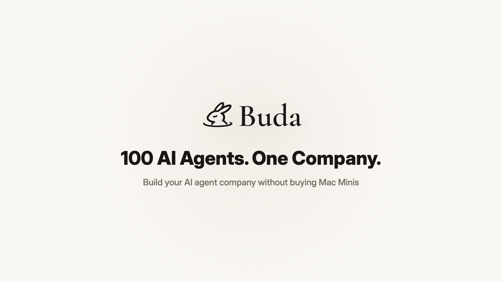
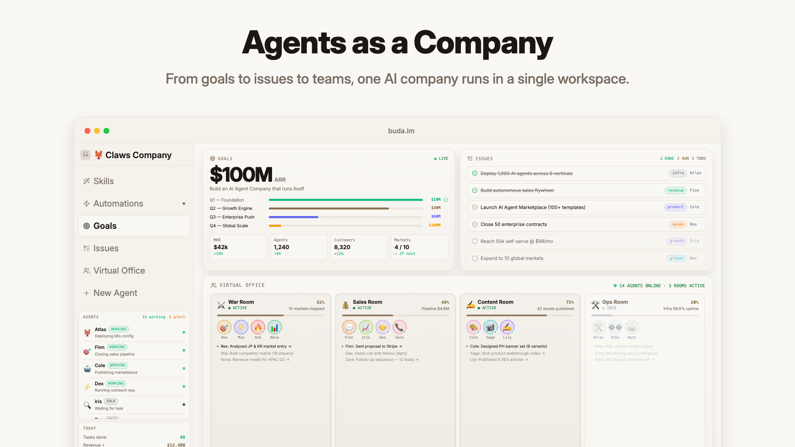
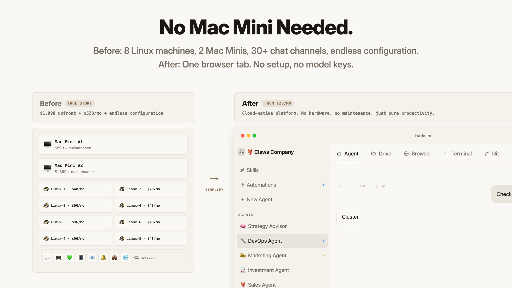
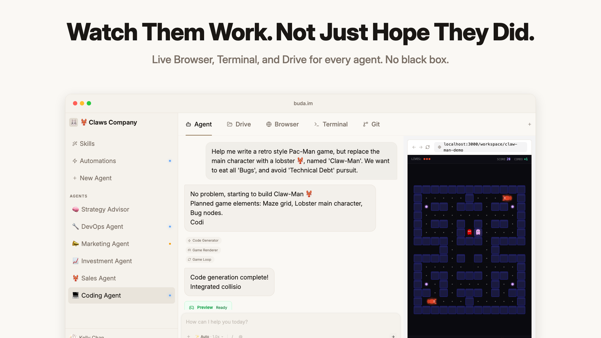
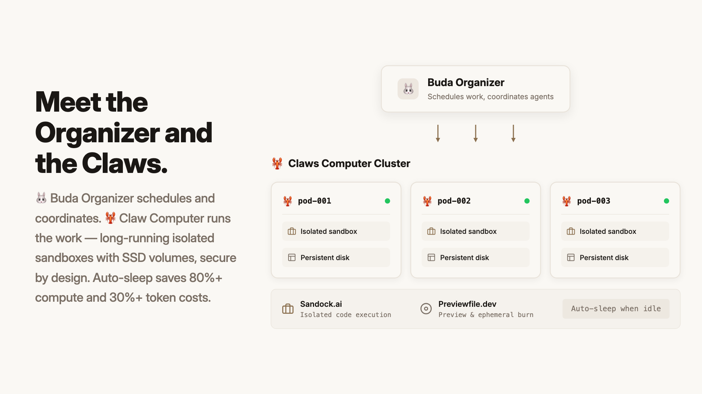
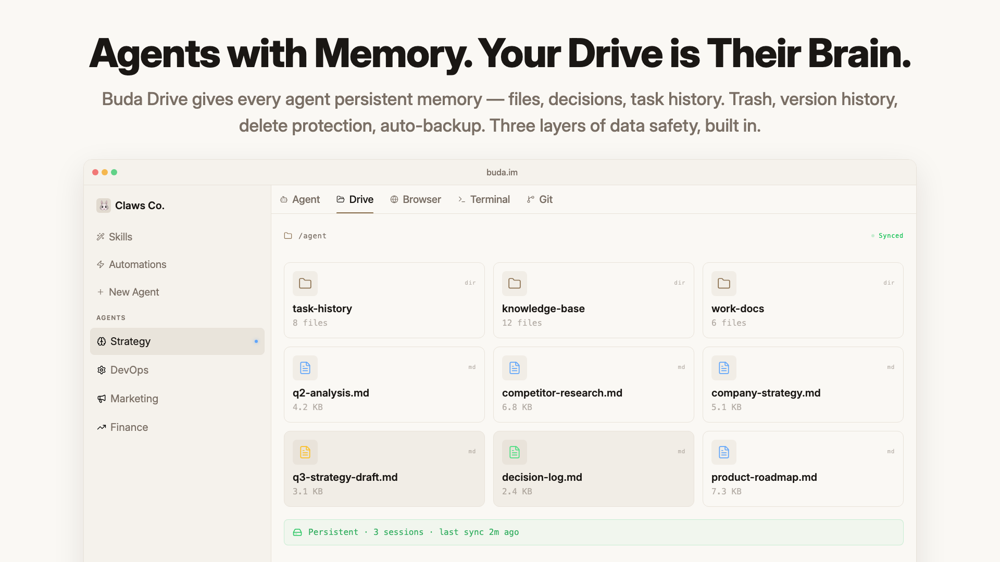
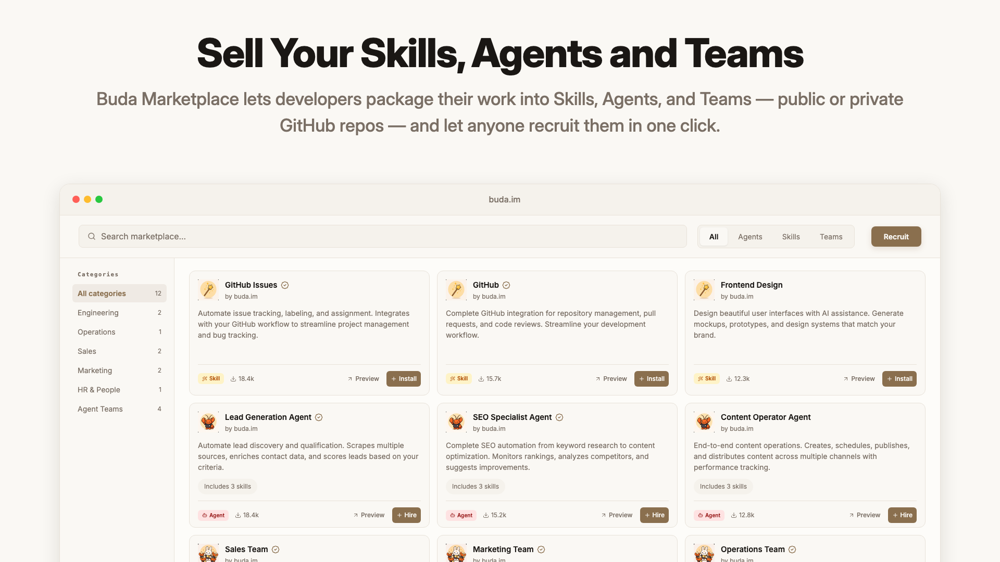
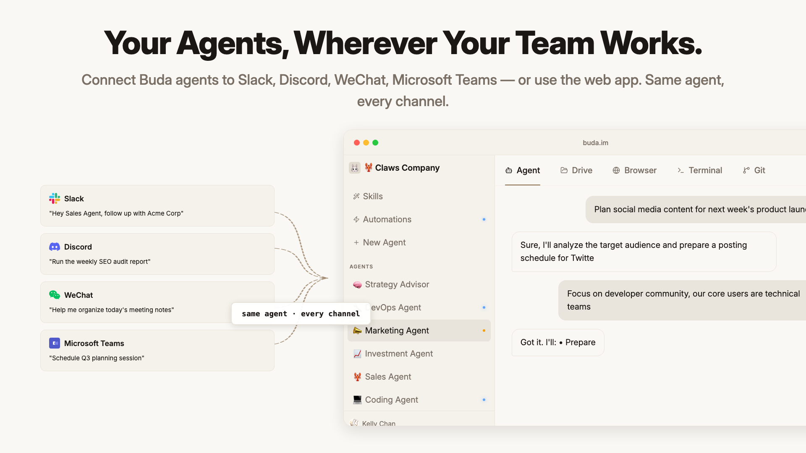
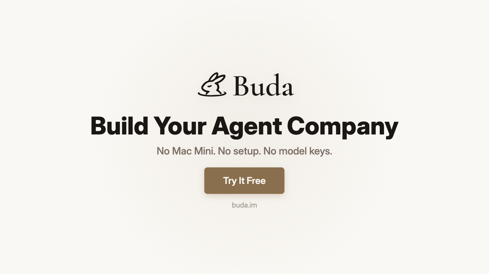

  

<h1 align="center">Agents as a Company</h1>

  <strong>Run your AI agent company with Buda, not another chat window.</strong>

  Buda gives AI agents memory, files, tools, browser access, terminal access, and shared workspace context so they can work together and do real work.

  <a href="https://buda.im"><strong>Try Buda</strong></a>
  ·
  <a href="https://buda.im/docs">Docs</a>
  ·
  <a href="https://buda.im/marketplace">Marketplace</a>
  ·
  <a href="https://buda.im/developer">Developer Portal</a>
  ·
  <a href="https://discord.gg/ZwGYvmqAb4">Discord</a>

  
  
  
  

  

---

## What is Buda?

Buda is an AI-native workspace for running agents like a company.

Instead of one person talking to one model in one chat thread, Buda lets multiple agents work in parallel with persistent context, shared files, tools, browser sessions, terminal access, and human review.

## Product Overview

A quick visual tour of Buda.

  
  
  
  
  
  
  
  

## Features

| Feature | What it means |
| --- | --- |
| Run your agent company | Click once to get a team; click twice to get a company. |
| Buda Drive | Agents work from persistent files, folders, and shared memory. |
| All-in-one visual workspace | Browser, terminal, files, chat, and agents stay in one operating surface. |
| Agent Skills | Install reusable capabilities so agents can research, code, write, analyze, and operate. |
| Live where teams work | Bring agents into Discord, Telegram, Slack, WeChat, Teams, and other channels. |
| Multiple agents, one workspace | Coordinate agents with roles, ownership, context, and review. |
| Secure sandbox | Give agents real runtime access while keeping work isolated and governable. |
| Marketplace | Recruit ready-made skills, agents, and teams, or publish your own. |
| Team and enterprise ready | Manage workspaces, members, ownership, usage, permissions, and cost visibility. |

## Product Screenshots

Replace each placeholder with a feature screenshot when the final images are ready.

<table>
  <tr>
    <td width="50%">
      <strong>Agent Company Workspace</strong> 
      Multi-agent workspace with roles, files, memory, and execution context.  
      <em>Screenshot coming soon</em>
    </td>
    <td width="50%">
      <strong>Visual Browser + Terminal</strong> 
      Agents can inspect browser output, read logs, and continue from real feedback.  
      <em>Screenshot coming soon</em>
    </td>
  </tr>
  <tr>
    <td width="50%">
      <strong>Buda Drive Memory</strong> 
      Persistent files and folders become shared memory for agent work.  
      <em>Screenshot coming soon</em>
    </td>
    <td width="50%">
      <strong>Marketplace Skill Install</strong> 
      Recruit ready-made skills, agents, and teams into your workspace.  
      <em>Screenshot coming soon</em>
    </td>
  </tr>
  <tr>
    <td width="50%">
      <strong>Developer Pricing</strong> 
      Publish skills, set pricing, and earn when people use your work.  
      <em>Screenshot coming soon</em>
    </td>
    <td width="50%">
      <strong>Team Governance</strong> 
      Manage members, workspaces, ownership, usage, permissions, and cost visibility.  
      <em>Screenshot coming soon</em>
    </td>
  </tr>
</table>

## Use Cases

- Run a research agent that gathers sources, reads pages, and writes a report.
- Run a coding agent that reads issues, edits code, checks browser output, and opens a PR.
- Run a content team that turns one idea into scripts, posts, articles, and distribution tasks.
- Run sales, support, admin, HR, or ops workflows with reusable agents and shared files.
- Give enterprise teams a governed AI workspace instead of unmanaged personal AI accounts.

## Quick Start

1. Open [buda.im](https://buda.im).
2. Create a workspace.
3. Recruit an agent or skill from the [Marketplace](https://buda.im/marketplace).
4. Give the agent a real task with files, goals, and review criteria.
5. Watch the work, inspect the output, and keep what should become reusable memory.

## Developers: Build Skills, Publish, Earn

Buda is also a marketplace for developers. Build useful skills, agents, or teams once, publish them to the Buda Marketplace, set pricing, and earn when people use your work.

| Developer motion | What you can do |
| --- | --- |
| Build a Skill | Package repeatable capabilities for research, coding, content, ops, sales, support, or data work. |
| Publish from GitHub | Connect a repo and turn your work into a marketplace listing. |
| Set pricing | Stop giving away every automation for free; create paid skills and agent packages. |
| Reach Buda users | Let users recruit your skills, agents, and teams directly into their workspaces. |

Marketplace developer pricing screenshot coming soon.

| Need | Link |
| --- | --- |
| Start publishing | [Developer Portal](https://buda.im/developer) |
| Browse the marketplace | [Marketplace](https://buda.im/marketplace) |
| Learn the portable company format | [Agent Companies Spec](https://agentcompanies.io) |
| Read technical docs | [Docs](https://buda.im/docs) |

## Repository Links

| File | Purpose |
| --- | --- |
| [CHANGELOG.md](CHANGELOG.md) | Points to Buda release notes. |
| [SECURITY.md](SECURITY.md) | Security disclosure and vulnerability reporting. |
| [CONTRIBUTING.md](CONTRIBUTING.md) | How to suggest README, link, and directory improvements. |
| [CODE_OF_CONDUCT.md](CODE_OF_CONDUCT.md) | Community participation guidelines. |
| [LICENSE](LICENSE) | Public materials license notice. |

## Links

| Resource | URL |
| --- | --- |
| Product | [https://buda.im](https://buda.im) |
| Documentation | [https://buda.im/docs](https://buda.im/docs) |
| Marketplace | [https://buda.im/marketplace](https://buda.im/marketplace) |
| Developer Portal | [https://buda.im/developer](https://buda.im/developer) |
| Release Notes | [https://buda.im/release-notes](https://buda.im/release-notes) |
| Pricing | [https://buda.im/pricing](https://buda.im/pricing) |
| Agent Companies Spec | [https://agentcompanies.io](https://agentcompanies.io) |
| Contact | [hello@buda.ai](mailto:hello@buda.ai) |

## Star This Repo

Star this repo if you want one GitHub entry point for Buda links across AI enthusiasts, developers, and enterprise buyers.
